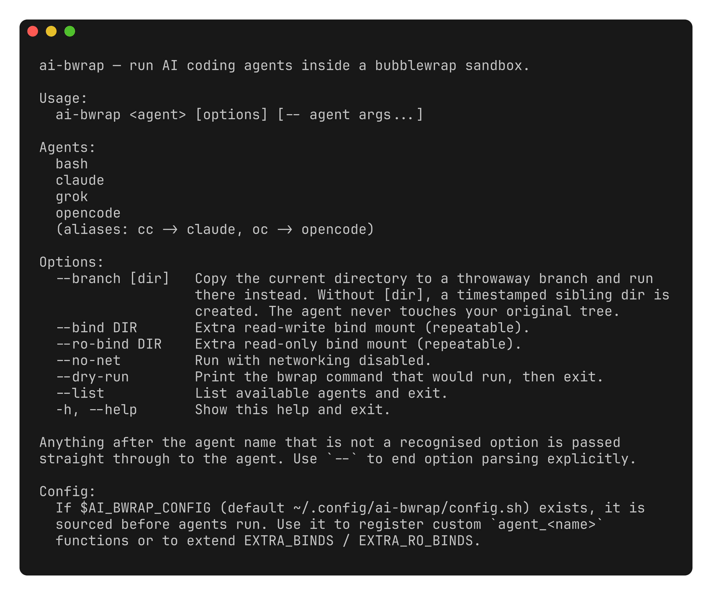
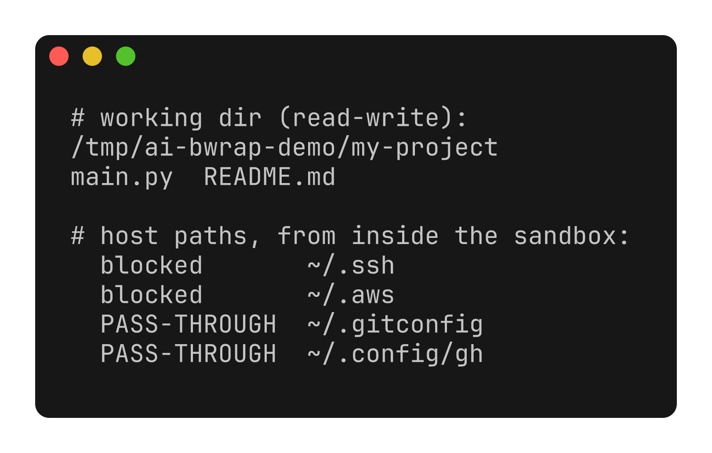

# ai-bwrap

**Run AI coding agents inside a [bubblewrap](https://github.com/containers/bubblewrap) sandbox — one wrapper, any agent.**

[](https://github.com/didvc/ai-bwrap/actions/workflows/ci.yml)
[](LICENSE)
[](ai-bwrap)
[](#requirements)

`ai-bwrap` launches an AI coding agent — **Claude Code**, **opencode**, **Grok**, or a plain **shell** — inside a `bwrap` namespace. The agent gets read-write access **only to your current working directory**; the rest of `$HOME` stays hidden. Just the config, cache, and state directories an agent actually needs are passed through.

It is the multi-agent sequel to [`opencode-bwrap`](https://github.com/didvc/opencode-bwrap): instead of wrapping a single tool, agents are declared as small shell functions, so the registry is **extensible without touching the wrapper**.



## Why

AI coding agents run shell commands, edit files, and fetch from the network on your behalf. Run directly, they can read anything you can — `~/.ssh`, `~/.aws`, browser profiles, every other project on disk. `ai-bwrap` confines them to the directory you're actually working in, while still passing through the toolchains and credentials they legitimately need (git, `gh`, Node/NVM, Cargo, …).



## Requirements

- Linux
- [`bwrap`](https://github.com/containers/bubblewrap) (bubblewrap):
  ```sh
  sudo apt install bubblewrap     # Debian/Ubuntu
  sudo pacman -S bubblewrap       # Arch
  sudo dnf install bubblewrap     # Fedora
  ```
- The agent you want to run (`claude`, `opencode`, `grok`, …) on your `$PATH`.

## Installation

```sh
cp ai-bwrap ~/.local/bin/ai-bwrap
chmod +x ~/.local/bin/ai-bwrap
```

## Usage

```sh
ai-bwrap <agent> [options] [-- agent args...]
```

Built-in agents: `claude`, `opencode`, `grok`, `bash` (aliases: `cc` → claude, `oc` → opencode).

```sh
cd /path/to/your/project

ai-bwrap claude                       # Claude Code, confined to this directory
ai-bwrap oc --model anthropic/claude-sonnet-4-5   # opencode, flags passed through
ai-bwrap grok                         # Grok CLI
ai-bwrap bash                         # a shell inside the sandbox, to inspect it
```

Anything after the agent name that `ai-bwrap` doesn't recognize is passed straight to the agent. Use `--` to end option parsing explicitly.

### Options

| Option | Description |
|---|---|
| `--branch [dir]` | Copy the current directory to a throwaway branch and run there instead. Without `[dir]`, a timestamped sibling directory is created. Your original tree is never touched. |
| `--bind DIR` | Extra read-write bind mount (repeatable). |
| `--ro-bind DIR` | Extra read-only bind mount (repeatable). |
| `--no-net` | Run with networking disabled. |
| `--dry-run` | Print the `bwrap` command that would run, then exit. |
| `--list` | List available agents. |
| `-h`, `--help` | Show help. |

## What the sandbox blocks

| Resource | Behavior |
|---|---|
| Files outside `$PWD` | Not visible (no bind) |
| `~/.ssh`, `~/.aws`, secrets, other projects | Not mounted |
| `$HOME` (other than passed-through dirs) | Empty virtual dir |
| Physical block devices (`/dev/sda`, …) | Not present |
| Host processes (other PIDs) | Isolated PID namespace |
| `sudo` / privilege escalation | Blocked — no setuid in the namespace |

## What is passed through

Common to every agent (read-only unless noted): `$PWD` **(read-write)**, `~/.gitconfig`, `~/.config/gh`, `$NVM_DIR`, `~/.pyenv`, `~/.local/bin`, `~/.npm` (rw), `~/.cargo` (rw), `/usr`, `/etc`.

Each agent additionally passes through its own config/cache/state (e.g. `~/.claude`, `~/.config/opencode`, `~/.grok`). See the agent functions in [`ai-bwrap`](ai-bwrap) for the exact list.

## Custom agents

An agent is just a function named `agent_<name>` that declares its binds and the command to run. Define your own in `~/.config/ai-bwrap/config.sh` (override with `$AI_BWRAP_CONFIG`) — no need to edit the wrapper:

```sh
# ~/.config/ai-bwrap/config.sh
agent_aider() {
    AGENT_BINDS+=( --bind-try "$HOME/.aider" "$HOME/.aider" )
    EXEC_CMD=("$(require_cmd aider)")
}

# Extend the binds shared by all agents:
EXTRA_RO_BINDS+=( "$HOME/reference-repos" )
```

The same file can append to `EXTRA_BINDS` (read-write) and `EXTRA_RO_BINDS` (read-only). `ai-bwrap --list` shows custom agents alongside the built-ins.

## Security notes

`bwrap` uses Linux namespaces — the host kernel is shared. This is stronger isolation than running an agent directly, and lighter than a VM. For everyday development it's a practical tradeoff, but be aware:

- The host kernel is shared; a kernel-level exploit could escape the sandbox.
- Anything explicitly bind-mounted is reachable by the agent — keep the passthrough list minimal.
- The `claude` agent runs with `--dangerously-skip-permissions` on the rationale that the sandbox *is* the boundary, so in-app prompts are redundant. Override by passing your own flags after `--`.

See [SECURITY.md](SECURITY.md) for the vulnerability reporting process.

## Acknowledgements

Builds on [`opencode-bwrap`](https://github.com/didvc/opencode-bwrap) and the [bubblewrap](https://github.com/containers/bubblewrap) project.

## Contributing

Contributions welcome — see [CONTRIBUTING.md](CONTRIBUTING.md) and the [Code of Conduct](CODE_OF_CONDUCT.md).

## License

[MIT](LICENSE)

---

<sub>ai-bwrap is the multi-agent successor to [`opencode-bwrap`](https://github.com/didvc/opencode-bwrap), the original single-tool sandbox wrapper.</sub>
